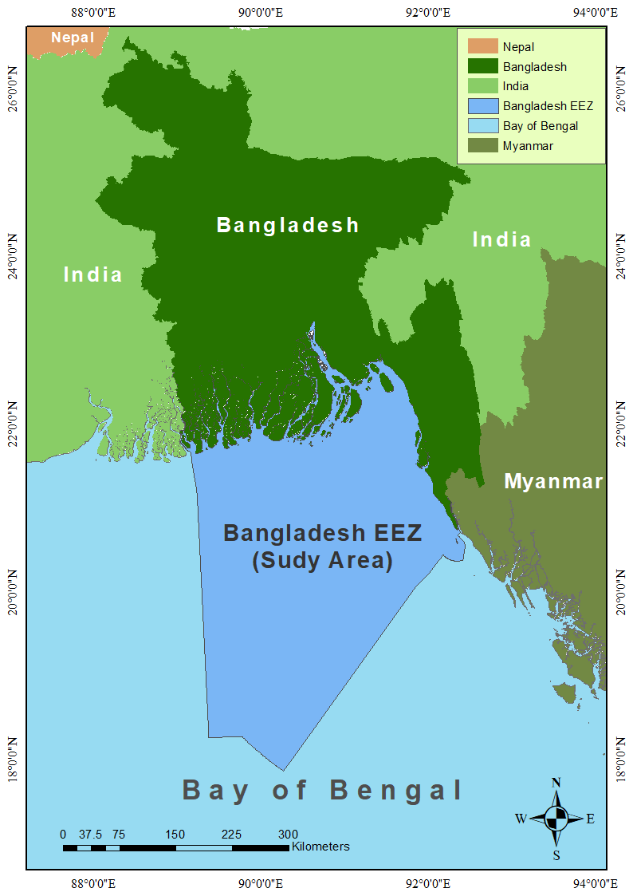
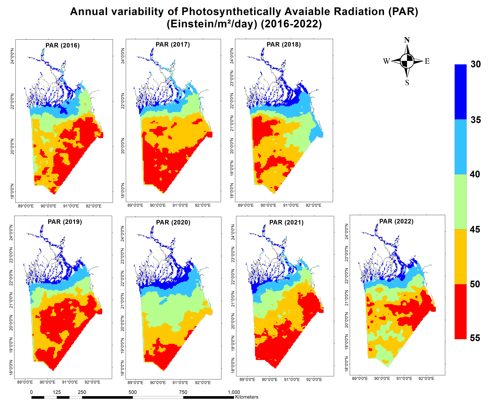
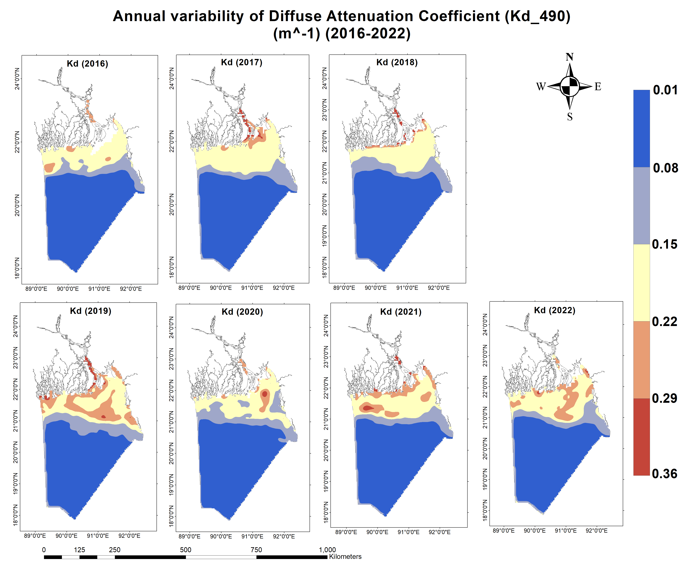
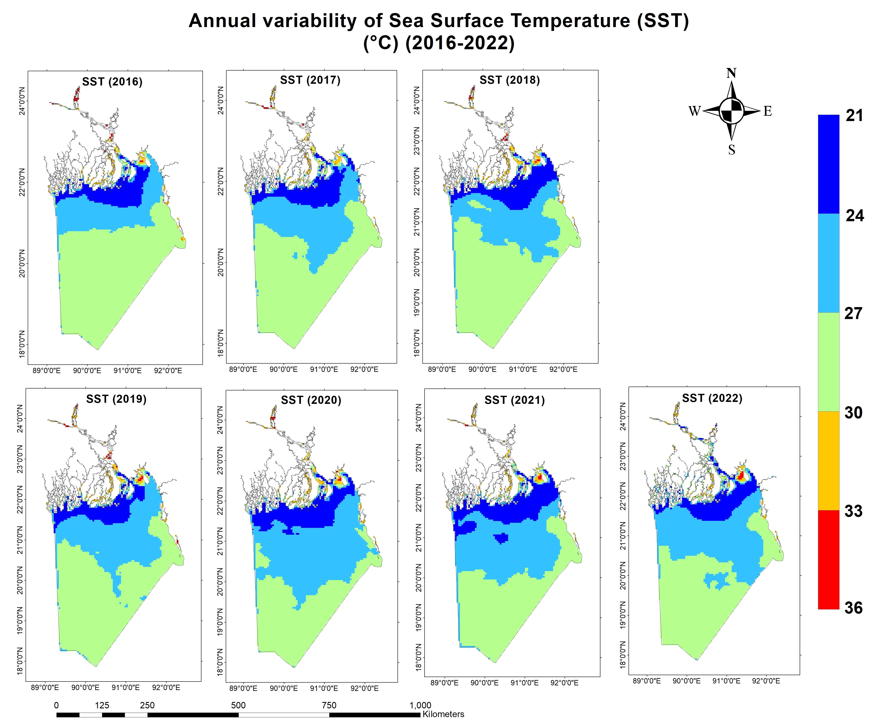

<h2>About Me</h2>

  

    I am an Oceanography graduate and geospatial enthusiast with a strong foundation in remote sensing, GIS mapping, and environmental data science. My expertise spans geospatial analysis, spatial modeling, and advanced data visualization, with proficiency in tools such as ArcGIS, SeaDAS, and Google Earth Engine for satellite data processing and geographic analysis.
  

  

    In addition to my technical skills, I am experienced in programming with Python and R, as well as advanced MS Excel, enabling me to apply computational, statistical, and spatial approaches to complex environmental and oceanographic datasets. I am particularly passionate about leveraging these skills to address practical challenges in coastal and urban systems, contributing to innovative, data-driven research and solutions.
  

<h2>Research Interests</h2>
<ul style="list-style:none; padding-left:0;">
  <li style="margin-bottom:24px; display:flex; align-items:flex-start;">
    
      🌍
    
    

      
Remote Sensing & GIS Applications

      
Satellite data analysis, spatial modeling, and geospatial data management.

    

  </li>
  <li style="margin-bottom:24px; display:flex; align-items:flex-start;">
    
      📊
    
    

      
Oceanographic Data Science

      
Computational and statistical approaches to marine and atmospheric datasets.

    

  </li>
  <li style="margin-bottom:24px; display:flex; align-items:flex-start;">
    
      🌊
    
    

      
Coastal & Urban Flood Risk Assessment

      
Integrated modeling, spatial analysis, and machine learning applications.

    

  </li>
  <li style="margin-bottom:24px; display:flex; align-items:flex-start;">
    
      🌡️
    
    

      
Climate Change & Environmental Monitoring

      
Impacts on coastal ecosystems, agriculture, and trade vulnerability.

    

  </li>
  <li style="margin-bottom:24px; display:flex; align-items:flex-start;">
    
      🤖
    
    

      
Geospatial Artificial Intelligence (GeoAI)

      
Machine learning and predictive modeling for environmental systems.

    

  </li>
  <li style="margin-bottom:24px; display:flex; align-items:flex-start;">
    
      ⚓
    
    

      
Marine & Coastal Resource Management

      
Sustainable development, conservation, and blue economy applications.

    

  </li>
</ul>

<h2>Research Projects</h2>
  <h3 style="margin-bottom: 5px;">Spatial and Temporal Variability of PAR, Kd490, and SST in the Bangladesh EEZ (2016–2022)</h3>
  
Undergraduate Project &nbsp; | &nbsp; <b>Supervisor:</b> Abu Bokkar Siddique &nbsp; | &nbsp; Jul 2023 - Dec 2023

  

    
    <!-- Representative Project Image 
    

    
      
      
      
      
     
 -->

    <!-- Project Highlights -->
    

    
      <h4 style="margin-bottom:.2em;">Project Summary</h4>
      

      
 This research investigates how <strong>Photosynthetically Available Radiation (PAR)</strong>, <strong>Diffuse Attenuation Coefficient (Kd490)</strong>, and <strong>Sea Surface Temperature (SST)</strong> vary both spatially and temporally in the Bangladesh Exclusive Economic Zone (EEZ) from 2016 to 2022. Using satellite-derived data (MODIS-Aqua) processed in SeaDAS and ArcGIS, the study analyzes monthly and annual trends for each parameter. The aim is to reveal how these physical factors influence marine ecosystems in the Bay of Bengal and to provide insights crucial for sustainable management amid climate change.

      
 
      
       <h4 style="margin-bottom:.2em;">Key Findings</h4>
       

          <ul style="margin-top:0;">
            <li>PAR ranged from <b>32.47 – 55 Einstein/m²/day</b> with higher values offshore and seasonal highs in May–July.</li>
            <li>Kd490 values indicated higher water turbidity (up to <b>0.33 m⁻¹</b>) near coastlines due to runoff &amp; anthropogenic impacts.</li>
            <li>SST varied seasonally from <b>22°C – 31°C</b>, revealing a subtle multi-year warming trend.</li>
          </ul>
        

       
<h4 style="margin-bottom: .2em;">
  <a href="./projects/undergrad_project.pdf" 
     target="_blank" 
     style="text-decoration: none; color: inherit; display: inline-flex; align-items: center; gap: 6px;">
    View Full Project
    <svg xmlns="http://www.w3.org/2000/svg" 
         width="18" height="18" fill="currentColor" 
         viewBox="0 0 24 24" style="margin-left: 4px;">
      <path d="M14 3h7v7h-2V6.41l-9.29 9.3-1.42-1.42 9.3-9.29H14V3z"/>
      <path d="M5 5h5V3H3v7h2V5zm0 14v-5H3v7h7v-2H5z"/>
    </svg>
  </a>
</h4>

  <h3 style="margin-top: 1.3em; margin-bottom: 5px;"> Quantitative Analysis of Annual Chlorophyll-a and Sea Surface Temperature Fluctuations in the Bay of Bengal Using Remote Sensing Data</h3>
  
Lab Project &nbsp; | &nbsp; <b>Supervisor:</b> Dr. Subrata Sarker &nbsp; | &nbsp; May 2023 - Jun 2023

  

    
    <!-- Representative Project Image 
    

    
      
      
      
      
     
 -->

    <!-- Project Highlights -->
    

    
      <h4 style="margin-bottom:.2em;">Project Summary</h4>
      

      
 This research analyzes the spatial and temporal patterns of Chlorophyll-a concentration and Sea Surface Temperature (SST) in the Bay of Bengal using monthly satellite data from January to December 2020. Data were sourced from the NASA Ocean Color Web and processed using SNAP and ArcMap software. Specific coastal regions near Bangladesh were selected for detailed comparison, while regional and seasonal variability across the Bay was mapped and quantified. The study aimed to enrich understanding of marine ecological dynamics and climate processes in the Bay of Bengal, providing valuable data for marine research and management.

      
 
      
       <h4 style="margin-bottom:.2em;">Key Findings</h4>
       

          <ul style="margin-top:0;">
            <li>Chlorophyll-a levels were <b>lowest</b> in May and peaked in August, indicating strong seasonal variation.</li>   
            <li>Sea Surface Temperature (SST) <b>increased</b> gradually from January, peaked in May, then declined after October.</li>
            <li>There was a <b>negative correlation</b> between chlorophyll-a and SST: higher chlorophyll was found when SST was lower.</li>
            </ul>
      

       
<h4 style="margin-bottom: .2em;">
  <a href="./projects/4_1_project.pdf" 
     target="_blank" 
     style="text-decoration: none; color: inherit; display: inline-flex; align-items: center; gap: 6px;">
    View Full Project
    <svg xmlns="http://www.w3.org/2000/svg" 
         width="18" height="18" fill="currentColor" 
         viewBox="0 0 24 24" style="margin-left: 4px;">
      <path d="M14 3h7v7h-2V6.41l-9.29 9.3-1.42-1.42 9.3-9.29H14V3z"/>
      <path d="M5 5h5V3H3v7h2V5zm0 14v-5H3v7h7v-2H5z"/>
    </svg>
  </a>
</h4>

